# Paper Ideas

## Overall heap organization

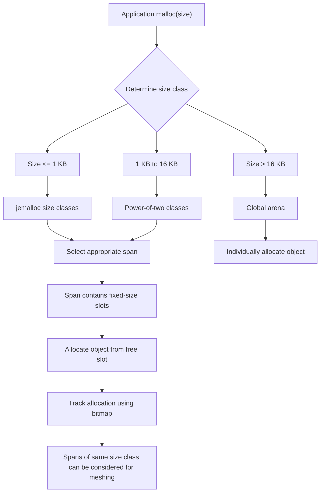
```mermaid
flowchart TD
    A["Application malloc(size)"] --> B{"Determine size class"}

    B --> C["Size <= 1 KB"]
    B --> D["1 KB to 16 KB"]
    B --> E["Size > 16 KB"]

    C --> F["jemalloc size classes"]
    D --> G["Power-of-two classes"]

    F --> H["Select appropriate span"]
    G --> H

    H --> I["Span contains fixed-size slots"]
    I --> J["Allocate object from free slot"]

    E --> K["Global arena"]
    K --> L["Individually allocate object"]

    J --> M["Track allocation using bitmap"]
    M --> N["Spans of same size class can be considered for meshing"]
```

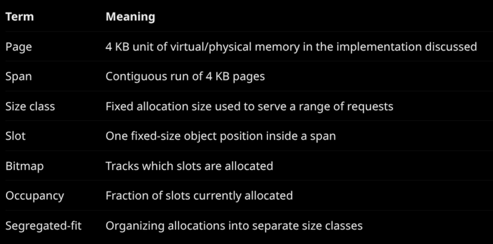

## Section 2.1: Remapping Virtual Pages

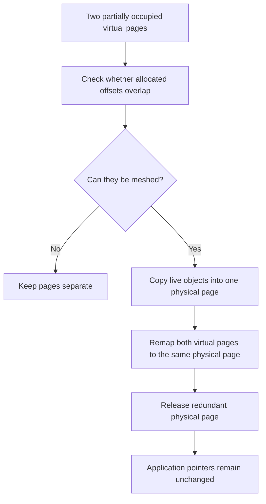
```mermaid
flowchart TD
    A["Two partially occupied virtual pages"] --> B["Check whether allocated offsets overlap"]
    B --> C{"Can they be meshed?"}
    C -->|"No"| D["Keep pages separate"]
    C -->|"Yes"| E["Copy live objects into one physical page"]
    E --> F["Remap both virtual pages to the same physical page"]
    F --> G["Release redundant physical page"]
    G --> H["Application pointers remain unchanged"]
```

## Section 2.2: Random Allocation

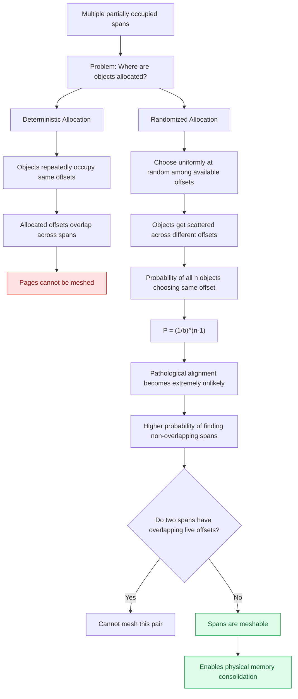
```mermaid
flowchart TD
    A["Multiple partially occupied spans"] --> B["Problem: Where are objects allocated?"]

    B --> C["Deterministic Allocation"]
    B --> D["Randomized Allocation"]

    C --> E["Objects repeatedly occupy same offsets"]
    E --> F["Allocated offsets overlap across spans"]
    F --> G["Pages cannot be meshed"]

    D --> H["Choose uniformly at random among available offsets"]
    H --> I["Objects get scattered across different offsets"]

    I --> J["Probability of all n objects choosing same offset"]
    J --> K["P = (1/b)^(n-1)"]

    K --> L["Pathological alignment becomes extremely unlikely"]
    L --> M["Higher probability of finding non-overlapping spans"]

    M --> N{"Do two spans have overlapping live offsets?"}
    N -->|"Yes"| O["Cannot mesh this pair"]
    N -->|"No"| P["Spans are meshable"]

    P --> Q["Enables physical memory consolidation"]

    style G fill:#fee2e2,stroke:#dc2626,color:#991b1b
    style P fill:#dcfce7,stroke:#16a34a,color:#166534
    style Q fill:#dcfce7,stroke:#16a34a,color:#166534
```

## Section 2.3: Finding Spans to Mesh

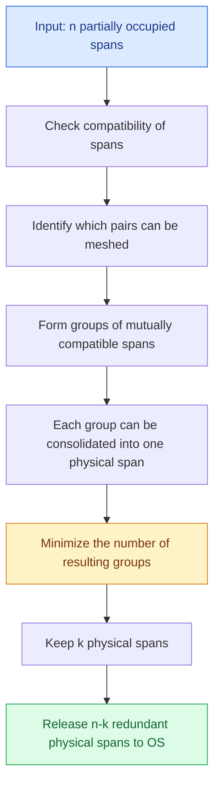
```mermaid
flowchart TD
    A["Input: n partially occupied spans"] --> B["Check compatibility of spans"]
    B --> C["Identify which pairs can be meshed"]
    C --> D["Form groups of mutually compatible spans"]
    D --> E["Each group can be consolidated into one physical span"]
    E --> F["Minimize the number of resulting groups"]
    F --> G["Keep k physical spans"]
    G --> H["Release n-k redundant physical spans to OS"]

    style A fill:#dbeafe,stroke:#2563eb,color:#1e3a8a
    style F fill:#fef3c7,stroke:#d97706,color:#78350f
    style H fill:#dcfce7,stroke:#16a34a,color:#166534
```

## Section 3.1: Allocation

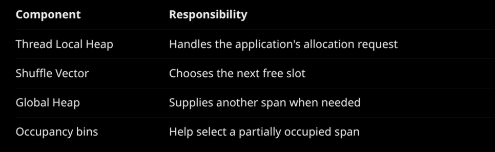

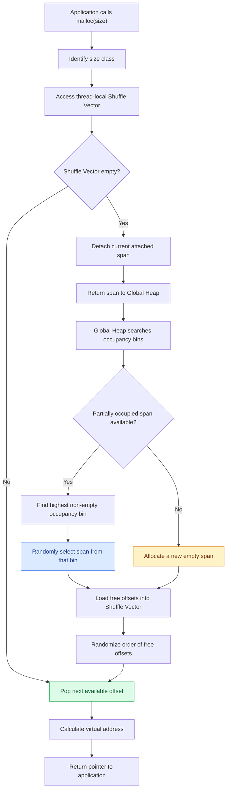
```mermaid
flowchart TD
    A["Application calls malloc(size)"] --> B["Identify size class"]
    B --> C["Access thread-local Shuffle Vector"]

    C --> D{"Shuffle Vector empty?"}

    D -->|"No"| E["Pop next available offset"]
    E --> F["Calculate virtual address"]
    F --> G["Return pointer to application"]

    D -->|"Yes"| H["Detach current attached span"]
    H --> I["Return span to Global Heap"]

    I --> J["Global Heap searches occupancy bins"]
    J --> K{"Partially occupied span available?"}

    K -->|"Yes"| L["Find highest non-empty occupancy bin"]
    L --> M["Randomly select span from that bin"]

    K -->|"No"| N["Allocate a new empty span"]

    M --> O["Load free offsets into Shuffle Vector"]
    N --> O

    O --> P["Randomize order of free offsets"]
    P --> E

    style E fill:#dcfce7,stroke:#16a34a,color:#166534
    style M fill:#dbeafe,stroke:#2563eb,color:#1e3a8a
    style N fill:#fef3c7,stroke:#d97706,color:#78350f
```

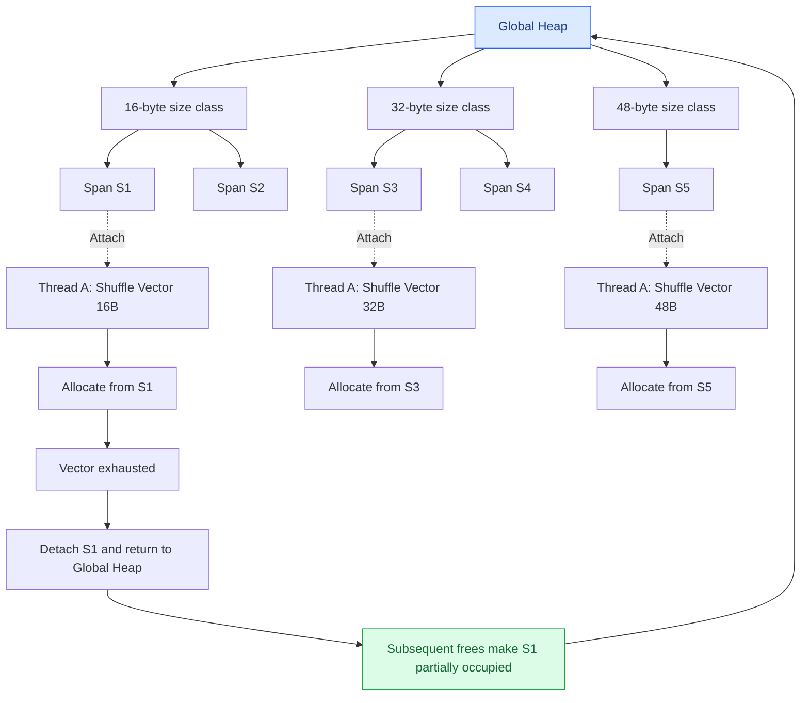
```mermaid

flowchart TD
    GH["Global Heap"]

    GH --> C16["16-byte size class"]
    GH --> C32["32-byte size class"]
    GH --> C48["48-byte size class"]

    C16 --> S1["Span S1"]
    C16 --> S2["Span S2"]
    C32 --> S3["Span S3"]
    C32 --> S4["Span S4"]
    C48 --> S5["Span S5"]

    S1 -. "Attach" .-> V1["Thread A: Shuffle Vector 16B"]
    S3 -. "Attach" .-> V2["Thread A: Shuffle Vector 32B"]
    S5 -. "Attach" .-> V3["Thread A: Shuffle Vector 48B"]

    V1 --> A["Allocate from S1"]
    V2 --> B["Allocate from S3"]
    V3 --> C["Allocate from S5"]

    A --> D["Vector exhausted"]
    D --> E["Detach S1 and return to Global Heap"]
    E --> F["Subsequent frees make S1 partially occupied"]
    F --> GH

    style GH fill:#dbeafe,stroke:#2563eb,color:#1e3a8a
    style F fill:#dcfce7,stroke:#16a34a,color:#166534
```

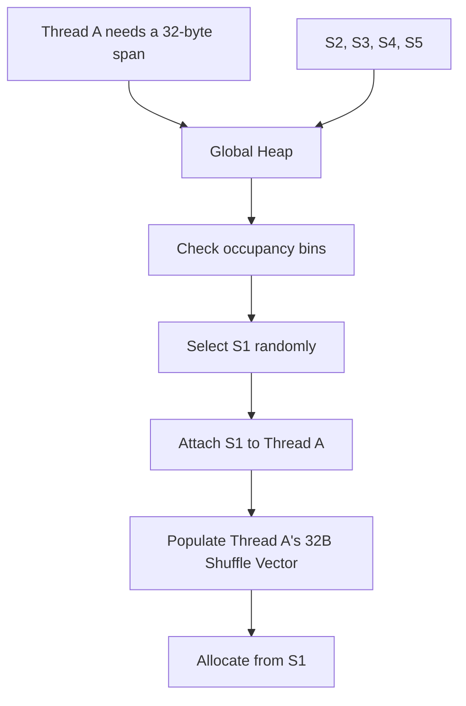
```mermaid
flowchart TD
    A["Thread A needs a 32-byte span"] --> B["Global Heap"]
    B --> C["Check occupancy bins"]
    C --> D["Select S1 randomly"]
    D --> E["Attach S1 to Thread A"]
    E --> F["Populate Thread A's 32B Shuffle Vector"]
    F --> G["Allocate from S1"]

    H["S2, S3, S4, S5"] --> B
```

## Section 3.2: Deallocation

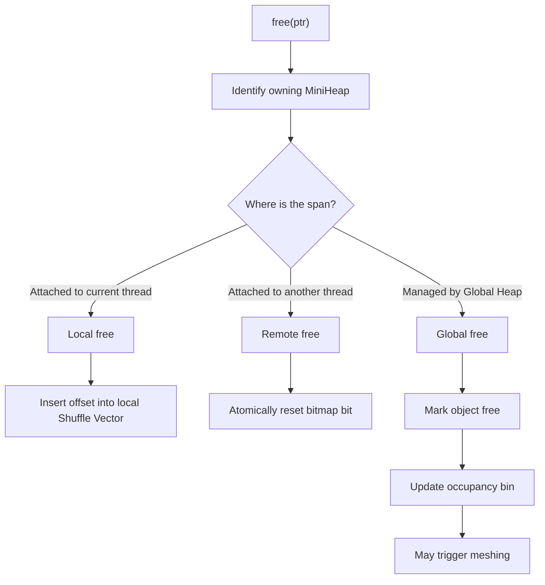
```mermaid
flowchart TD
    A["free(ptr)"] --> B["Identify owning MiniHeap"]
    B --> C{"Where is the span?"}

    C -->|"Attached to current thread"| D["Local free"]
    C -->|"Attached to another thread"| E["Remote free"]
    C -->|"Managed by Global Heap"| F["Global free"]

    D --> G["Insert offset into local Shuffle Vector"]
    E --> H["Atomically reset bitmap bit"]
    F --> I["Mark object free"]
    I --> J["Update occupancy bin"]
    J --> K["May trigger meshing"]
```

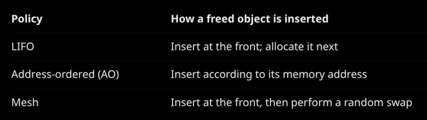

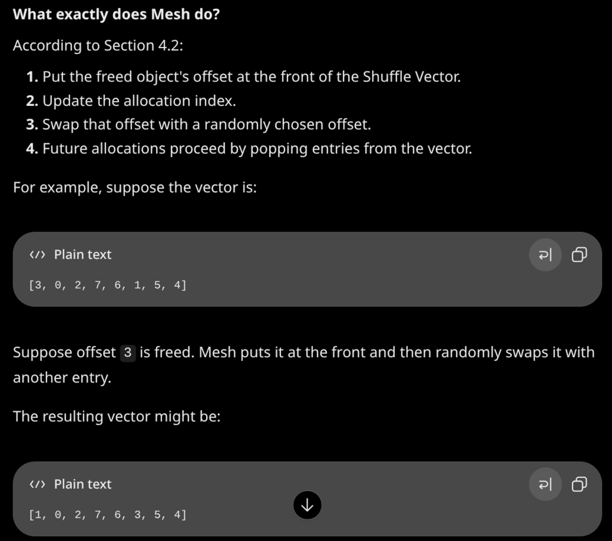

## Section 3.3: Meshing

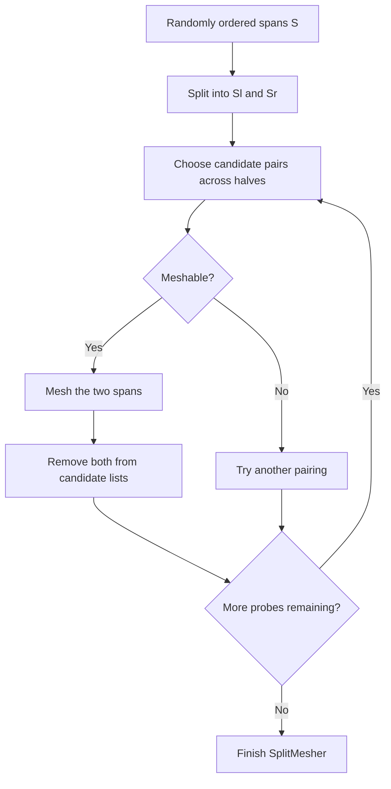
```mermaid
flowchart TD
    A["Randomly ordered spans S"] --> B["Split into Sl and Sr"]
    B --> C["Choose candidate pairs across halves"]
    C --> D{"Meshable?"}
    D -->|"Yes"| E["Mesh the two spans"]
    E --> F["Remove both from candidate lists"]
    D -->|"No"| G["Try another pairing"]
    F --> H{"More probes remaining?"}
    G --> H
    H -->|"Yes"| C
    H -->|"No"| I["Finish SplitMesher"]
```

## Section 4.1: MiniHeaps

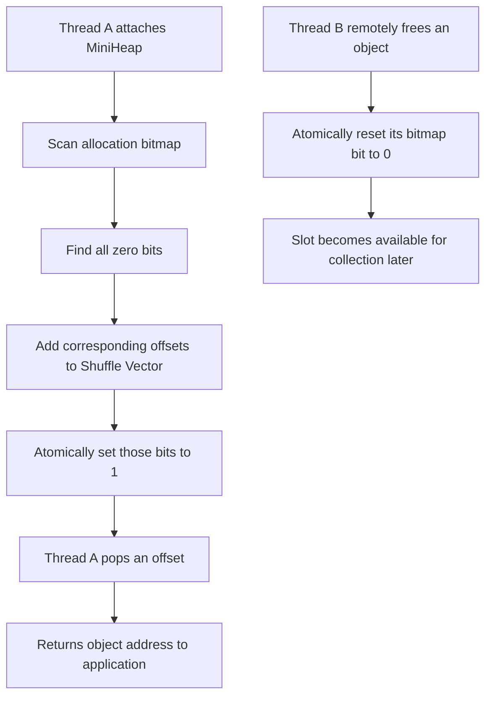
```mermaid
flowchart TD
    A["Thread A attaches MiniHeap"] --> B["Scan allocation bitmap"]
    B --> C["Find all zero bits"]
    C --> D["Add corresponding offsets to Shuffle Vector"]
    D --> E["Atomically set those bits to 1"]
    E --> F["Thread A pops an offset"]
    F --> G["Returns object address to application"]

    H["Thread B remotely frees an object"] --> I["Atomically reset its bitmap bit to 0"]
    I --> J["Slot becomes available for collection later"]
```

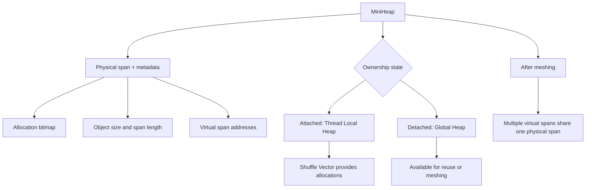
```mermaid
flowchart TD
    A["MiniHeap"] --> B["Physical span + metadata"]
    B --> C["Allocation bitmap"]
    B --> D["Object size and span length"]
    B --> E["Virtual span addresses"]

    A --> F{"Ownership state"}
    F --> G["Attached: Thread Local Heap"]
    F --> H["Detached: Global Heap"]

    G --> I["Shuffle Vector provides allocations"]
    H --> J["Available for reuse or meshing"]

    A --> K["After meshing"]
    K --> L["Multiple virtual spans share one physical span"]
```

## Section 4.2: Shuffle vectors

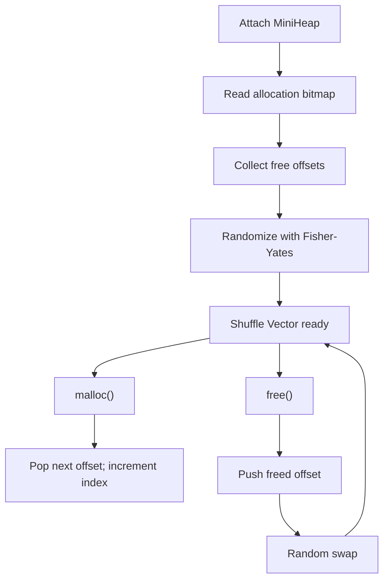
```mermaid
flowchart TD
    A["Attach MiniHeap"] --> B["Read allocation bitmap"]
    B --> C["Collect free offsets"]
    C --> D["Randomize with Fisher-Yates"]
    D --> E["Shuffle Vector ready"]

    E --> F["malloc()"]
    F --> G["Pop next offset; increment index"]

    E --> H["free()"]
    H --> I["Push freed offset"]
    I --> J["Random swap"]
    J --> E
```

## Section 4.3: Thread Local heaps

### How does malloc() works?

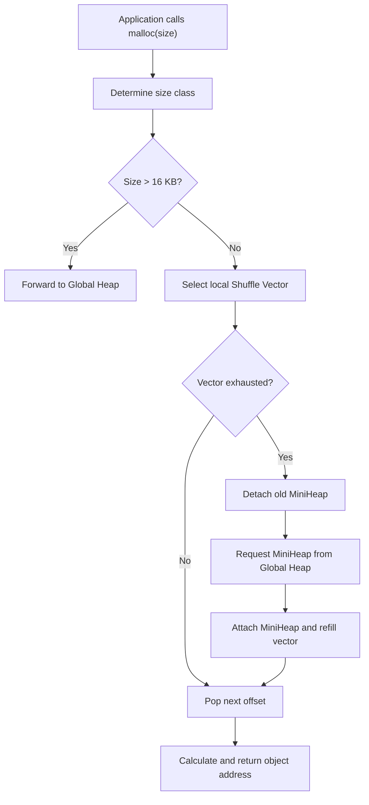
```mermaid
flowchart TD
    A["Application calls malloc(size)"] --> B["Determine size class"]
    B --> C{"Size > 16 KB?"}
    C -->|Yes| D["Forward to Global Heap"]
    C -->|No| E["Select local Shuffle Vector"]
    E --> F{"Vector exhausted?"}
    F -->|No| H["Pop next offset"]
    F -->|Yes| G["Detach old MiniHeap"]
    G --> I["Request MiniHeap from Global Heap"]
    I --> J["Attach MiniHeap and refill vector"]
    J --> H
    H --> K["Calculate and return object address"]
```

### How free() works?

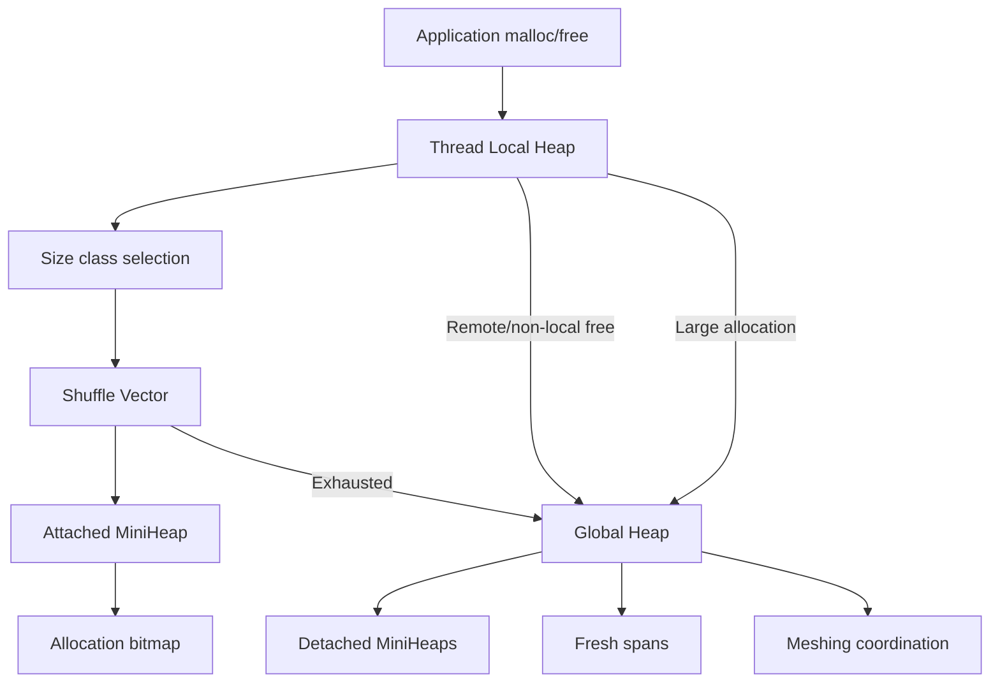
```mermaid
flowchart TD
    A["Application malloc/free"] --> B["Thread Local Heap"]
    B --> C["Size class selection"]
    C --> D["Shuffle Vector"]
    D --> E["Attached MiniHeap"]
    E --> F["Allocation bitmap"]

    D -->|"Exhausted"| G["Global Heap"]
    B -->|"Remote/non-local free"| G
    B -->|"Large allocation"| G

    G --> H["Detached MiniHeaps"]
    G --> I["Fresh spans"]
    G --> J["Meshing coordination"]
```

## Section 4.4: Global Heap

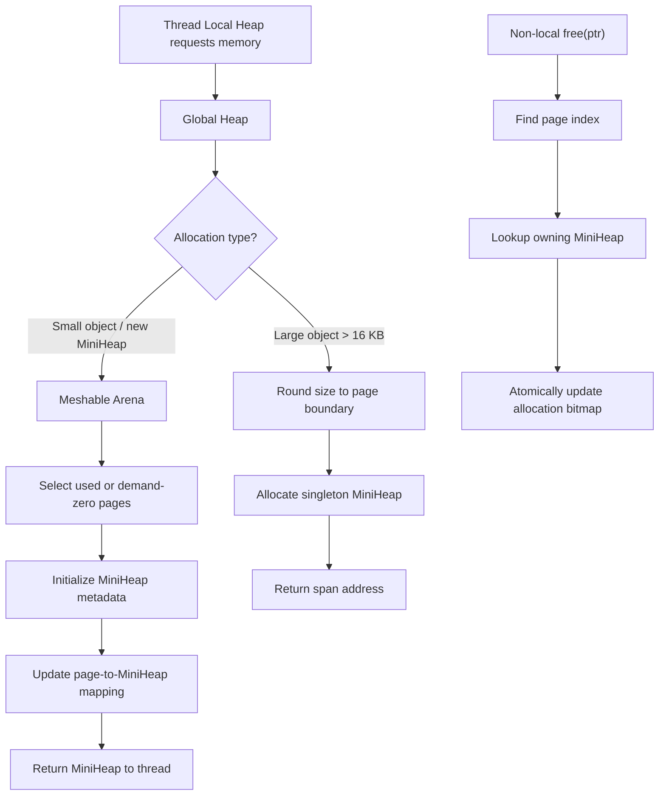
```mermaid
flowchart TD
    A["Thread Local Heap requests memory"] --> B["Global Heap"]
    B --> C{"Allocation type?"}

    C -->|"Small object / new MiniHeap"| D["Meshable Arena"]
    D --> E["Select used or demand-zero pages"]
    E --> F["Initialize MiniHeap metadata"]
    F --> G["Update page-to-MiniHeap mapping"]
    G --> H["Return MiniHeap to thread"]

    C -->|"Large object > 16 KB"| I["Round size to page boundary"]
    I --> J["Allocate singleton MiniHeap"]
    J --> K["Return span address"]

    L["Non-local free(ptr)"] --> M["Find page index"]
    M --> N["Lookup owning MiniHeap"]
    N --> O["Atomically update allocation bitmap"]
```

## Section 4.5: Meshing

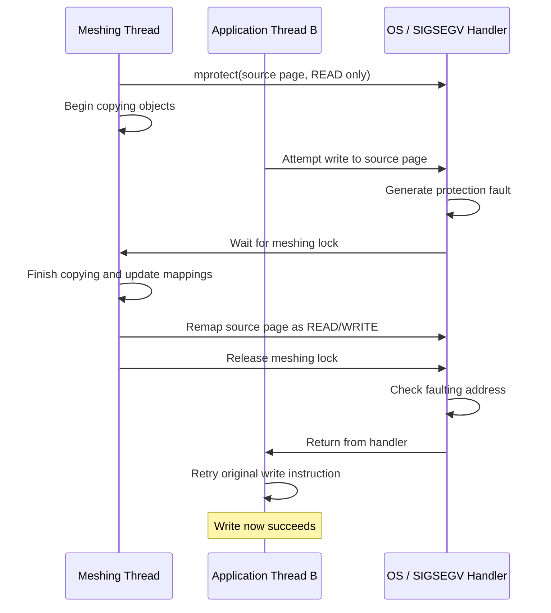
```mermaid
sequenceDiagram
    participant M as Meshing Thread
    participant B as Application Thread B
    participant OS as OS / SIGSEGV Handler

    M->>OS: mprotect(source page, READ only)
    M->>M: Begin copying objects

    B->>OS: Attempt write to source page
    OS->>OS: Generate protection fault
    OS->>M: Wait for meshing lock

    M->>M: Finish copying and update mappings
    M->>OS: Remap source page as READ/WRITE
    M->>OS: Release meshing lock

    OS->>OS: Check faulting address
    OS->>B: Return from handler
    B->>B: Retry original write instruction
    Note over B: Write now succeeds
```

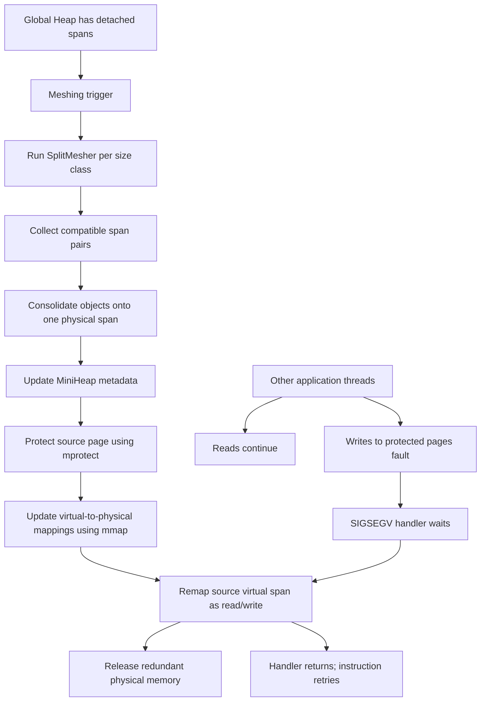
```mermaid
flowchart TD
    A["Global Heap has detached spans"] --> B["Meshing trigger"]
    B --> C["Run SplitMesher per size class"]
    C --> D["Collect compatible span pairs"]
    D --> E["Consolidate objects onto one physical span"]
    E --> F["Update MiniHeap metadata"]
    F --> G["Protect source page using mprotect"]
    G --> H["Update virtual-to-physical mappings using mmap"]
    H --> I["Remap source virtual span as read/write"]
    I --> J["Release redundant physical memory"]

    K["Other application threads"] --> L["Reads continue"]
    K --> M["Writes to protected pages fault"]
    M --> N["SIGSEGV handler waits"]
    N --> I
    I --> O["Handler returns; instruction retries"]
```

## Overall implementation

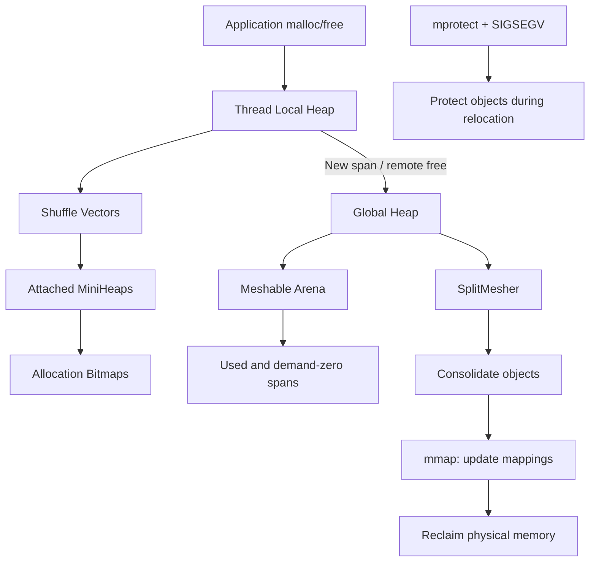
```mermaid
flowchart TD
    A["Application malloc/free"] --> B["Thread Local Heap"]
    B --> C["Shuffle Vectors"]
    C --> D["Attached MiniHeaps"]
    D --> E["Allocation Bitmaps"]

    B -->|"New span / remote free"| F["Global Heap"]
    F --> G["Meshable Arena"]
    G --> H["Used and demand-zero spans"]

    F --> I["SplitMesher"]
    I --> J["Consolidate objects"]
    J --> K["mmap: update mappings"]
    K --> L["Reclaim physical memory"]

    M["mprotect + SIGSEGV"] --> N["Protect objects during relocation"]
```